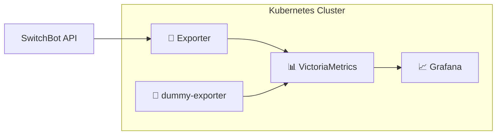

# スマートホーム監視基盤 - Kubernetesデプロイメント

SwitchBotデバイスを使った電力監視・コスト可視化システムのKubernetes構成。

## 🏗️ **アーキテクチャ概要**



### **コンポーネント構成**
| コンポーネント                                          | 役割                       | 詳細ドキュメント                |
| ------------------------------------------------------- | -------------------------- | ------------------------------- |
| **🔌 [Exporter](base/exporter/README.md)**               | データ収集エンジン         | SwitchBot APIから電力データ取得 |
| **🧪 [dummy-exporter](base/dummy-exporter/README.md)**   | 開発用ダミー生成器         | APIキー不要で動作確認できる     |
| **📊 [VictoriaMetrics](base/victoriametrics/README.md)** | 時系列データベース         | 電力データの永続化・クエリ処理  |
| **📈 [Grafana](base/grafana/README.md)**                 | 可視化ダッシュボード       | PromQL でメトリクスをグラフ化   |  | **🔗 [Tailscale Operator](base/tailscale/README.md)** | VPN 内 HTTPS 公開 | Grafana を Tailnet 経由で安全公開 |
| **🔐 [Secret 管理](secret/README.md)**                   | 認証情報のテンプレート管理 | `.env` から自動生成             |  | **⚡ BFF** *(未実装)*                                 | ビジネスロジック  | コスト計算・API提供               |
| **📱 Frontend** *(未実装)*                               | ユーザーインターフェース   | ダッシュボード・設定画面        |

## 📁 **ディレクトリ構成**

```
k8s/
├── base/                           # 共通基本設定
│   ├── namespace/                  # smart-home Namespace
│   ├── kustomization.yaml          # ベース統合設定
│   ├── exporter/
│   ├── dummy-exporter/
│   ├── victoriametrics/
│   └── grafana/
├── tailscale/                      # Tailscale Operator (Helm)
│   ├── README.md               # 🔗 起動手順・トラブルシューティング
│   ├── kustomization.yaml
│   ├── helm-values.yaml
│   └── namespace.yaml
├── secret/                         # Secret テンプレート管理
│   ├── README.md               # 🔐 Secret 追加手順・TODO
│   ├── switchbot-secret.template.yaml
│   └── tailscale-secret.template.yaml
└── overlays/                       # 環境固有設定
    ├── production/
    │   ├── kustomization.yaml
    │   ├── deployment-patch.yaml
    │   └── grafana-tailscale-patch.yaml
    └── staging/
        ├── kustomization.yaml
        └── grafana-tailscale-patch.yaml
```

## 🚀 **クイックスタート**

### **初回セットアップ**

```bash
# 1. 認証情報設定
vim .env  # SWITCHBOT_TOKEN, SWITCHBOT_SECRET, TAILSCALE_CLIENT_ID, TAILSCALE_CLIENT_SECRET を設定

# 2. Tailscale Operator インストール・認証情報登録
make k8s-tailscale-install

# 3. Smart Home 本番環境デプロイ
make k8s-deploy-production
```

### **2回目以降のデプロイ**

```bash
make k8s-deploy-production
```

## 📊 **監視・運用コマンド**

### **システム状態確認**
```bash
# 全リソース状態一覧
kubectl get all -n smart-home

# Pod詳細 & ログ確認
kubectl describe pods -n smart-home
kubectl logs -n smart-home --selector=app.kubernetes.io/part-of=smart-home-monitoring -f

# リソース使用量監視
kubectl top nodes
kubectl top pods -n smart-home
```

### **データ流通確認**
```bash
# 1. Exporter → メトリクス公開の確認
kubectl port-forward -n smart-home svc/exporter 8000:8000
curl http://localhost:8000/metrics | grep smart_home

# 2. VictoriaMetrics → データ蓄積の確認  
kubectl port-forward -n smart-home svc/victoria-metrics 8428:8428
curl "http://localhost:8428/api/v1/query?query=smart_home_power_watts"

# 3. OpenObserve → 可視化UIの確認
kubectl port-forward -n smart-home svc/openobserve 5080:5080
# http://localhost:5080
```

## 🔧 **設定カスタマイズ**

### **監視デバイスの追加**
デバイス設定は [`base/exporter/README.md`](base/exporter/README.md#設定のカスタマイズ) を参照

### **データ保持期間の変更**
VictoriaMetricsの保持期間は [`base/victoriametrics/README.md`](base/victoriametrics/README.md) を参照

## 🛠️ **利用可能なMakeコマンド**

```bash
# Secret 管理
make k8s-secret-generate     # .env から全 Secret を生成（SwitchBot + Tailscale）
make k8s-secret-clean        # 生成ファイルを削除

# Tailscale Operator
make k8s-tailscale-install   # Tailscale Operator のインストール/アップグレード

# 本番環境
make k8s-deploy-production   # 本番デプロイ（Secret 生成カーコミ）
```

## 🔄 **アップグレード・メンテナンス**

### **コンポーネントアップデート**
```bash
# コンポーネントアップデート
# overlays/production/kustomization.yaml の images タグを変更し再デプロイする
make k8s-deploy-production

# または Deployment を即座に再起動
kubectl rollout restart deployment -n smart-home
```

### **データバックアップ**
```bash
# VictoriaMetricsデータのスナップショット
kubectl port-forward -n smart-home svc/prod-victoriametrics 8428:8428
curl -X POST 'http://localhost:8428/snapshot/create'

# PVCの現在の動作確認
kubectl get pvc -n smart-home
```

## 📈 **次の実装フェーズ**

✅ **フェーズ1完了**: データ蓄積基盤（VictoriaMetrics）  
🚧 **フェーズ2**: コスト計算ロジック（[BFF API](../services/bff/README.md)）  
📅 **フェーズ3**: ダッシュボード（[Frontend](../services/frontend/README.md)）  
🎯 **フェーズ4**: AI予測・GitOps・通知機能

詳細な実装計画は [実装フェーズ計画](../IMPL_PHASE.md) を参照してください。