# スマートホーム監視基盤 - Kubernetesデプロイメント

SwitchBotデバイスを使った電力監視・コスト可視化システムのKubernetes構成。

## 🏗️ **アーキテクチャ概要**

```mermaid
graph LR
    A[SwitchBot API] --> B[📡 Exporter]
    B --> C[📊 VictoriaMetrics]
    C --> D[📈 Grafana]
    E[🧪 dummy-exporter] --> C
    
    subgraph "Kubernetes Cluster"
        B
        C  
        D
        E
    end
```



### **コンポーネント構成**
| コンポーネント                                          | 役割                     | 詳細ドキュメント                |
| ------------------------------------------------------- | ------------------------ | ------------------------------- |
| **🔌 [Exporter](base/exporter/README.md)**               | データ収集エンジン       | SwitchBot APIから電力データ取得 |
| **🧪 [dummy-exporter](base/dummy-exporter/README.md)**   | 開発用ダミー生成器       | APIキー不要で動作確認できる     |
| **📊 [VictoriaMetrics](base/victoriametrics/README.md)** | 時系列データベース       | 電力データの永続化・クエリ処理  |
| **📈 [Grafana](base/grafana/README.md)**                 | 可視化ダッシュボード     | PromQL でメトリクスをグラフ化   |
| **⚡ BFF** *(未実装)*                                    | ビジネスロジック         | コスト計算・API提供             |
| **📱 Frontend** *(未実装)*                               | ユーザーインターフェース | ダッシュボード・設定画面        |

## 📁 **ディレクトリ構成**

```
k8s/
├── base/                           # 共通基本設定
│   ├── namespace/                  # smart-home Namespace
│   ├── kustomization.yaml          # ベース統合設定
│   ├── exporter/                   # SwitchBot Exporter
│   │   ├── README.md               # 📡 データ収集の詳細
│   │   ├── deployment.yaml
│   │   ├── service.yaml
│   │   └── configmap.yaml
│   ├── dummy-exporter/             # 開発用ダミーメトリクス生成器
│   │   ├── README.md               # 🧪 dummy-exporter の詳細
│   │   ├── deployment.yaml
│   │   └── service.yaml
│   ├── victoriametrics/            # 時系列データベース
│   │   ├── README.md               # 📊 データ永続化の詳細
│   │   ├── deployment.yaml
│   │   ├── service.yaml
│   │   ├── configmap.yaml
│   │   └── pvc.yaml
│   └── grafana/                    # 可視化ダッシュボード
│       ├── README.md               # 📈 Grafana の詳細
│       ├── deployment.yaml
│       ├── service.yaml
│       ├── configmap.yaml
│       └── pvc.yaml
└── overlays/                       # 環境固有設定
    ├── mock/                       # 開発・テスト環境
    │   ├── kustomization.yaml
    │   └── deployment-patch.yaml
    └── production/                 # 本番環境
        ├── kustomization.yaml
        ├── secret.yaml
        └── deployment-patch.yaml
```

## 🚀 **クイックスタート**

### **本番環境デプロイ**  
実際のSwitchBotデバイスと連携：

```bash
# 認証情報設定
cp k8s/.env.example k8s/.env
vim k8s/.env  # SwitchBot APIキーを設定

# Secret生成 & デプロイ
make k8s-secret-generate
kubectl apply -k k8s/overlays/production

# 動作確認
kubectl logs -n smart-home -l app=switchbot-exporter -f
```

## 📊 **監視・運用コマンド**

### **システム状態確認**
```bash
# 全リソース状態一覧
kubectl get all -n smart-home

# Pod詳細 & ログ確認
kubectl describe pods -n smart-home
kubectl logs -n smart-home --selector=app.kubernetes.io/part-of=smart-home-monitoring -f

# リソース使用量監視
kubectl top nodes
kubectl top pods -n smart-home
```

### **データ流通確認**
```bash
# 1. Exporter → メトリクス公開の確認
kubectl port-forward -n smart-home svc/exporter 8000:8000
curl http://localhost:8000/metrics | grep smart_home

# 2. VictoriaMetrics → データ蓄積の確認  
kubectl port-forward -n smart-home svc/victoria-metrics 8428:8428
curl "http://localhost:8428/api/v1/query?query=smart_home_power_watts"

# 3. OpenObserve → 可視化UIの確認
kubectl port-forward -n smart-home svc/openobserve 5080:5080
# http://localhost:5080
```

## 🔧 **設定カスタマイズ**

### **監視デバイスの追加**
デバイス設定は [`base/exporter/README.md`](base/exporter/README.md#設定のカスタマイズ) を参照

### **データ保持期間の変更**
VictoriaMetricsの保持期間は [`base/victoriametrics/README.md`](base/victoriametrics/README.md) を参照

## 🛠️ **利用可能なMakeコマンド**

```bash
# Kubernetes関連
make k8s-secret-generate     # API認証情報のSecret生成
make k8s-deploy-mock         # モック環境デプロイ
make k8s-deploy-production   # 本番環境デプロイ
make k8s-secret-clean        # 生成ファイルクリーンアップ

# Docker開発環境
make docker-build-exporter   # Exporterイメージビルド
make docker-dev             # 開発環境起動（Prometheus付き）
make docker-down            # コンテナ停止・削除
make docker-logs            # ログ監視
```

## 🚨 **トラブルシューティング**

### **Pod起動失敗**
```bash
# イベント & Pod状態確認
kubectl get events -n smart-home --sort-by='.metadata.creationTimestamp'
kubectl describe pods -n smart-home

# イメージプル・リソース不足等の診断
kubectl get nodes
kubectl describe nodes
```

### **データ収集停止**
```bash
# Exporter側の問題
kubectl logs -n smart-home -l app=switchbot-exporter --tail=100

# VictoriaMetrics側の問題
kubectl logs -n smart-home -l app=victoriametrics --tail=100

# スクレイプターゲットの状態確認
kubectl port-forward -n smart-home svc/prod-victoriametrics 8428:8428
curl http://localhost:8428/targets

# Grafanaの問題
kubectl logs -n smart-home -l app=grafana --tail=100
```

### **ネットワーク疎通問題**
```bash
# サービス疎通確認
kubectl get svc -n smart-home
kubectl get endpoints -n smart-home

# Pod間通信テスト
kubectl exec -n smart-home victoria-metrics-0 -- curl -f http://exporter.smart-home.svc.cluster.local:8000/metrics
```

## 🔄 **アップグレード・メンテナンス**

### **コンポーネントアップデート**
```bash
# コンポーネントアップデート
# overlays/production/kustomization.yaml の images タグを変更し再デプロイする
make k8s-deploy-production

# または Deployment を即座に再起動
kubectl rollout restart deployment -n smart-home
```

### **データバックアップ**
```bash
# VictoriaMetricsデータのスナップショット
kubectl port-forward -n smart-home svc/prod-victoriametrics 8428:8428
curl -X POST 'http://localhost:8428/snapshot/create'

# PVCの現在の動作確認
kubectl get pvc -n smart-home
```

## 📈 **次の実装フェーズ**

✅ **フェーズ1完了**: データ蓄積基盤（VictoriaMetrics）  
🚧 **フェーズ2**: コスト計算ロジック（[BFF API](../services/bff/README.md)）  
📅 **フェーズ3**: ダッシュボード（[Frontend](../services/frontend/README.md)）  
🎯 **フェーズ4**: AI予測・GitOps・通知機能

詳細な実装計画は [実装フェーズ計画](../IMPL_PHASE.md) を参照してください。